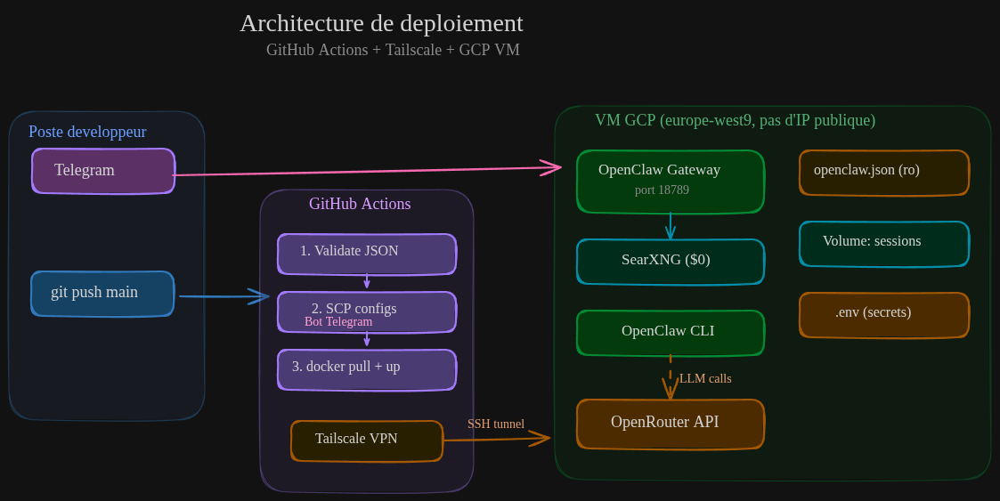
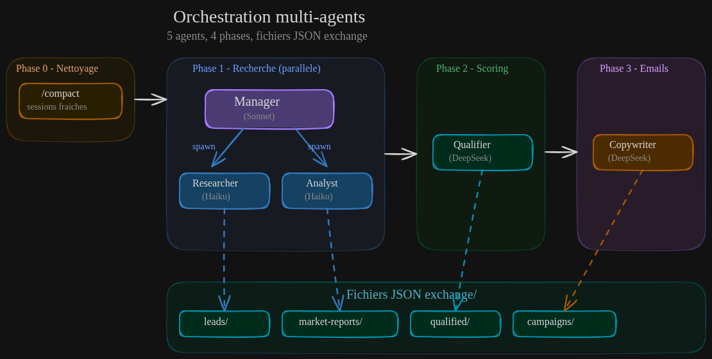
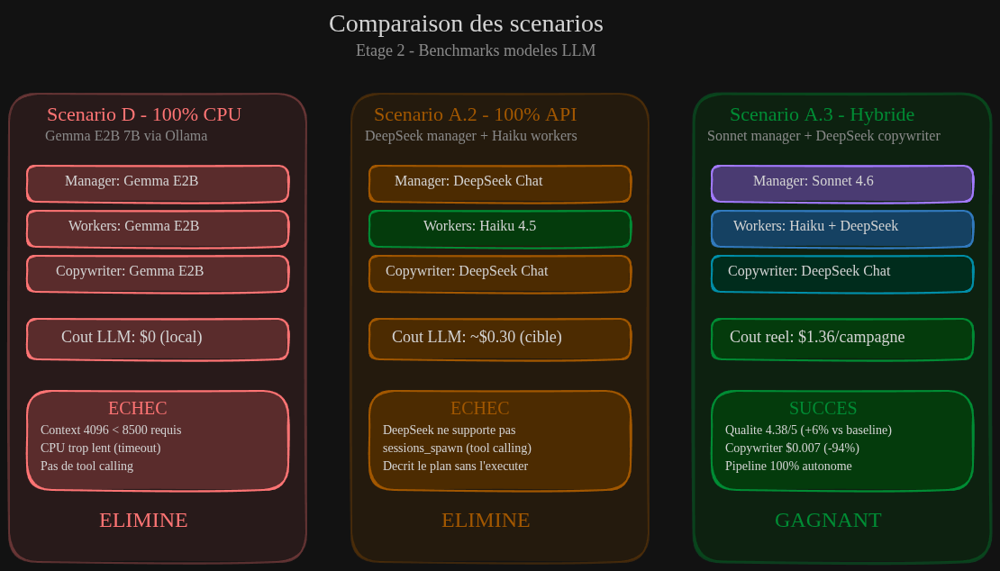

<div align="center">


**OpenClaw** | Pipeline de prospection IA multi-agents

</div>

Les pipelines multi-agents IA sont puissants : ils décomposent des tâches complexes en sous-tâches spécialisées, chacune confiée à un agent dédié. Mais cette puissance a un prix — **littéralement**. Chaque agent multiplie les appels LLM, et les coûts explosent vite sans optimisation.

Nous avons mené une expérimentation complète en **une journée** : 6 campagnes de prospection B2B, 4 configurations différentes, et un résultat concret — **-23% de coûts et +6% de qualité**. Voici notre retour d'expérience, avec les chiffres réels, les erreurs, et les enseignements.

## 1. Le pipeline et son architecture

### 1.1 Les 5 agents

Notre pipeline de prospection B2B utilise **OpenClaw**, un orchestrateur multi-agents open-source, piloté par Telegram. Cinq agents collaborent pour produire une campagne complète :

| Agent | Rôle | Modèle LLM | Coût/[Mtok](# "Mtok = million de tokens. Un token correspond a environ 4 caracteres ou 3/4 d'un mot. C'est l'unite de facturation des LLM") output |
|-------|------|------------|-----------------|
| **Prospection Manager** | Orchestre les 4 phases, synthèse | Claude Sonnet 4.6 | $15.00 |
| **Lead Researcher** | Recherche et enrichissement des prospects | Claude Haiku 4.5 | $4.00 |
| **Market Analyst** | Analyse marché, concurrents, opportunités | Claude Haiku 4.5 | $4.00 |
| **Lead Qualifier** | Scoring [BANT](# "Budget, Authority, Need, Timeline — methode de qualification commerciale qui evalue si un prospect a le budget, le pouvoir de decision, le besoin reel et un calendrier pour acheter") et classification [Tier A/B/C](# "Systeme de classification des leads par priorite : Tier A = haute priorite (score > 75), Tier B = moyenne (50-74), Tier C = faible (< 50)") | DeepSeek Chat | $1.10 |
| **Copywriter** | Rédaction d'emails personnalisés | DeepSeek Chat | $1.10 |

### 1.2 Architecture de déploiement

L'infrastructure repose sur une **VM GCP sans IP publique**, accessible uniquement via un [VPN Tailscale](# "Tailscale est un VPN mesh zero-config base sur WireGuard. Il cree un reseau prive entre vos machines sans ouvrir de ports, avec authentification par identite"). Aucun code source ni git sur la VM — c'est un **runtime pur** piloté intégralement par le pipeline CI/CD.



**Points clés de l'architecture** :

- **Sécurité** : pas d'IP publique, VPN Tailscale, SSH clé ED25519 sur port non standard, [fail2ban](# "Outil de securite Linux qui surveille les logs et bloque automatiquement les adresses IP ayant trop de tentatives de connexion echouees")
- **CI/CD intelligent** : chaque `git push` déclenche validation JSON → copie configs → `docker pull` + `up` — automatique
- **Hot-reload** : la config OpenClaw (`openclaw.json`) est montée en bind mount `:ro`, les changements sont appliqués sans redémarrage
- **SearXNG** : moteur de recherche self-hosted ($0) intégré au compose, remplace Perplexity Sonar Pro

## 2. Le diagnostic : où part l'argent ?

### 2.1 Anatomie d'un appel LLM

À chaque tour de conversation, OpenClaw envoie au LLM un contexte complet :

```
System prompt (~8 500 tokens)         ← renvoyé à CHAQUE appel
├── Instructions OpenClaw            ~2 000 tokens
├── AGENTS.md de l'agent             ~300 tokens
├── SOUL.md + IDENTITY.md            ~300 tokens
├── Descriptions des outils          ~3 000 tokens
├── Skills chargés                   ~1 000 tokens
└── Contexte session/heartbeat       ~500 tokens

Historique session (cumule)           ← 2 000 → 50 000+ tokens
Message courant                      ~100 tokens

TOTAL PAR APPEL : 10 000 → 60 000+ tokens input
```

Avec 5 agents et environ 5 tours chacun par campagne, le system prompt seul consomme **212 500 tokens** — avant même le contenu utile.

### 2.2 Le coût caché : Perplexity Sonar Pro

En analysant le rapport OpenRouter après notre première campagne, nous avons découvert un poste de coût **invisible** :

| Modèle | Coût | % du total | Requêtes |
|--------|------|-----------|----------|
| Claude Sonnet 4.6 | $1.03 | 61% | 31 |
| **Perplexity Sonar Pro** | **$0.44** | **26%** | **32** |
| Claude Haiku 4.5 | $0.19 | 11% | 15 |
| DeepSeek Chat | $0.02 | 1% | 3 |

**Perplexity représentait 26% du coût total** — et n'apparaissait nulle part dans les sessions des agents. Pourquoi ? L'outil `web_search` d'OpenClaw auto-détecte le provider de recherche. Comme seule `OPENROUTER_API_KEY` était configurée, il utilisait **Perplexity Sonar Pro via OpenRouter** — un modèle LLM de recherche à $15/Mtok output.

Ce coût était **invisible** dans les logs des agents : les appels Perplexity sont des tool calls internes facturées par OpenRouter mais non tracées dans les fichiers de session.

### 2.3 Baseline : $1.76 par campagne

Notre première campagne (tout Sonnet + Perplexity) coûtait **$1.76**. Extrapolé à 30 campagnes/mois + VM GCP, le budget mensuel dépassait **$80/mois** — inacceptable pour un outil de prospection.

## 3. L'orchestration multi-agents

Le manager orchestre 4 phases séquentielles, avec des sous-agents lancés via [`sessions_spawn`](# "Outil OpenClaw qui permet a un agent de lancer un sous-agent dans une session independante. Le sous-agent execute sa tache et renvoie le resultat automatiquement au parent") :



| Phase | Agents | Mode | Fichier exchange |
|-------|--------|------|-----------------|
| **Phase 0** | Manager | Nettoyage sessions | — |
| **Phase 1** | Researcher + Analyst | **Parallèle** | `leads/`, `market-reports/` |
| **Phase 2** | Qualifier | Séquentiel | `qualified/` |
| **Phase 3** | Copywriter | Séquentiel | `campaigns/` |

Chaque agent lit et écrit des fichiers JSON dans un répertoire `exchange/` partagé. Le manager attend les résultats via [`sessions_yield()`](# "Outil OpenClaw qui met l'agent parent en pause jusqu'a ce que le sous-agent termine sa tache. Permet l'orchestration sequentielle : lancer un worker, attendre son resultat, puis continuer") avant de passer à la phase suivante.

## 4. Méthodologie d'optimisation

Nous avons adopté une approche en **deux étages** :

- **Étage 1** : optimisations structurelles (s'appliquent à tous les scénarios)
- **Étage 2** : benchmarks de modèles LLM (branches git `bench/*`)

Pour chaque campagne, le même brief de prospection est utilisé : *"TPE/PME du département 37, besoin d'accompagnement IA"*. Les coûts sont mesurés via notre script `cost-report.sh` (tarifs OpenRouter réels) et validés par les rapports d'activité OpenRouter (source de vérité).

## 5. Les optimisations qui ont marché

### 5.1 SearXNG self-hosted : de $0.44 à $0

La découverte du coût caché Perplexity nous a conduits à **SearXNG**, un méta-moteur de recherche open-source. Hébergé sur notre VM en container Docker, il élimine 100% des coûts de recherche web :

| | Perplexity (avant) | SearXNG (après) |
|--|--------------------|--------------------|
| Coût/campagne | $0.44 | **$0** |
| Qualité recherche | Excellente (synthèse IA) | Bonne (résultats bruts) |
| Souveraineté | Non (US) | **Totale (local)** |
| Latence | 3-6s | 1-3s |

La qualité est suffisante car **ce sont les agents LLM qui font la synthèse** — la synthèse IA de Perplexity était redondante.

**Configuration** : forcer `"provider": "searxng"` dans `openclaw.json` pour court-circuiter l'auto-détection qui favorise Perplexity.

### 5.2 Prompt caching : 67% de cache hit

Le **[prompt caching](# "Mecanisme d'Anthropic qui met en cache les portions statiques du prompt (system prompt, instructions). Le premier appel coute +25%, mais les suivants coutent -90% sur les tokens caches. Le cache expire apres 5 minutes d'inactivite")** d'Anthropic réduit le coût des tokens input répétés de 90%. Comme le system prompt (~8 500 tokens) est identique entre les appels, il est mis en cache automatiquement. Résultat : **cache hit ratio de 56% → 67%** sur 3 campagnes.

### 5.3 Fix copywriter : de timeout à autonome

Le copywriter devait rédiger 3 emails par lead (initial + 2 relances) × 11 leads = **33 emails**. Il timeoutait systématiquement, forçant le manager (Sonnet, le modèle le plus cher) à reprendre le travail.

**Solution** :
- ❌ Avant : 3 emails/lead, timeout 180s → manager reprend ($1.25 en Sonnet)
- ✅ Après : 1 email/lead, timeout 300s → copywriter termine seul ($0.12)

### 5.4 Résultat Étage 1

| Métrique | Avant | Après Étage 1 | Gain |
|----------|-------|--------------|------|
| Coût/campagne | $1.76 | $1.49 | **-15%** |
| Recherche web | $0.44 | $0 | **-100%** |
| Cache hit | 0% | 67% | — |
| Pipeline | Manager reprend | **Autonome** | ✅ |

## 6. Les 3 scénarios testés (Étage 2)

L'Étage 1 optimisé, le poste dominant restait **Sonnet** ($1.31 = 88% du coût). L'Étage 2 a testé 3 alternatives :



### 6.1 Scénario D — Gemma E2B sur CPU : ❌ Échec

**Idée** : tout en local avec Ollama, $0 de coût LLM.

**Réalité** : le modèle 7B sur notre e2-standard-4 (CPU, 16 GB RAM) ne peut pas fonctionner :
- Context window effectif : 4 096 tokens vs 8 500 nécessaires pour le system prompt d'OpenClaw
- Inférence trop lente : timeout même pour des tâches simples (slug generator à 15s)
- Aucun tool calling fonctionnel

### 6.2 Scénario A.2 — DeepSeek manager : ❌ Échec

**Idée** : remplacer Sonnet par DeepSeek ($1.10/Mtok vs $15/Mtok) pour le manager.

**Réalité** : DeepSeek ne maîtrise pas le **tool calling** d'OpenClaw. Il décrit le plan d'orchestration de manière éloquente — mais **n'exécute jamais les [`sessions_spawn`](# "Outil OpenClaw qui lance un sous-agent dans une session independante")**. Les workers ne sont jamais lancés. L'agent simule l'exécution au lieu de la réaliser.

> *"Phase 1 (Recherche et Analyse) en cours... J'attends les résultats..."*
> — DeepSeek, après 10 minutes sans avoir lancé aucun worker

### 6.3 Scénario A.3 — Sonnet + DeepSeek copywriter : ✅ Gagnant

**Idée** : garder Sonnet uniquement pour l'orchestration (tool calling critique) et basculer le copywriter sur DeepSeek (rédaction pure, pas de tool calling complexe).

**Résultat** :

| Agent | Modèle | Qualité | Coût |
|-------|--------|---------|------|
| Manager | Sonnet | ✅ Tool calling OK | $0.71 |
| Researcher | Haiku | 4.0/5 | $0.38 |
| Analyst | Haiku | 4.5/5 | $0.13 |
| Qualifier | DeepSeek | 4.5/5 | $0.03 |
| **Copywriter** | **DeepSeek** | **4.5/5** | **$0.007** |

Le copywriter DeepSeek produit des emails de qualité comparable à Sonnet — personnalisés, avec des arguments chiffrés et des CTA variés — pour **94% moins cher**.

## 7. Résultats et enseignements

### Tableau comparatif final

| Métrique | Baseline (tout Sonnet) | Scénario A.3 (gagnant) | Gain |
|----------|----------------------|------------------------|------|
| **Coût/campagne** | $1.76 | **$1.36** | **-23%** |
| Recherche web | $0.44 (Perplexity) | $0 (SearXNG) | -100% |
| Qualité moyenne | 4.13/5 | **4.38/5** | **+6%** |
| Cache hit ratio | 0% | 67% | — |
| Pipeline | Copywriter timeout | **100% autonome** | ✅ |
| Coût/mois (30 camp) | ~$53 | **~$41** | -$12/mois |

### 5 enseignements

- ✅ **Le tool calling est le facteur discriminant** : seul Sonnet maîtrise [`sessions_spawn`](# "Outil OpenClaw qui lance un sous-agent dans une session independante"). DeepSeek et Gemma E2B échouent. Le manager doit rester sur un modèle capable de tool calling complexe.

- ✅ **Les coûts cachés pèsent plus que prévu** : Perplexity Sonar Pro représentait 26% du coût total, invisible dans les logs. Toujours vérifier les rapports du provider (OpenRouter) comme source de vérité.

- ✅ **Chaque agent a un besoin différent** : le manager a besoin de tool calling (Sonnet), le copywriter de rédaction (DeepSeek suffit), les workers de suivre des instructions (Haiku suffit). Un seul modèle pour tous est du gaspillage.

- ✅ **L'inférence locale CPU est un mirage** : pour des agents avec des system prompts > 8K tokens et du tool calling, un modèle 7B sur CPU est inutilisable. Il faut soit un GPU (coûteux), soit rester en API.

- ✅ **La qualité et le coût ne sont pas corrélés linéairement** : DeepSeek ($1.10/Mtok) produit des emails de qualité identique à Sonnet ($15/Mtok) pour la rédaction. La réduction de coût de 94% n'a pas dégradé la qualité.

## Conclusion

En une journée d'expérimentation systématique — 6 campagnes, 4 configurations, mesures rigoureuses — nous avons réduit le coût de notre pipeline de prospection de **23%** tout en améliorant la qualité de **6%**.

La configuration de production finale :
- **Sonnet** pour l'orchestration (seul modèle fiable pour le tool calling multi-agents)
- **DeepSeek** pour la rédaction et le scoring (qualité équivalente, 94% moins cher)
- **Haiku** pour la recherche et l'analyse (bon ratio qualité/prix pour le traitement de données)
- **SearXNG** self-hosted pour la recherche web ($0, souveraineté totale)

Les prochaines étapes : maîtriser le volume de recherches web des agents (principal levier restant), et étudier l'inférence GPU pour les modèles locaux si le volume de campagnes augmente.

---

*Vous déployez un pipeline multi-agents et les coûts vous préoccupent ? [Contactez-nous](../index.html#contact) — nous partageons volontiers notre méthodologie d'optimisation.*
